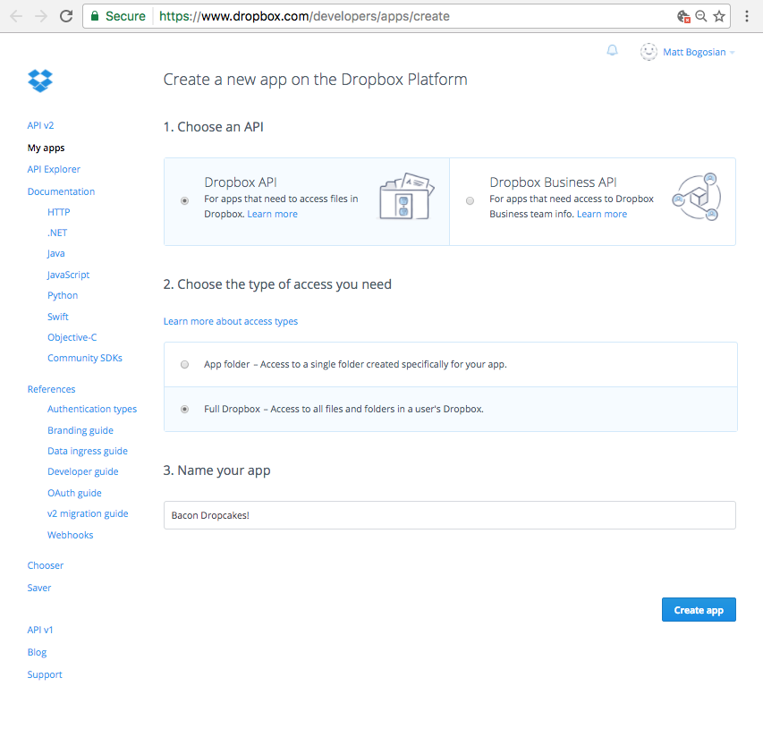
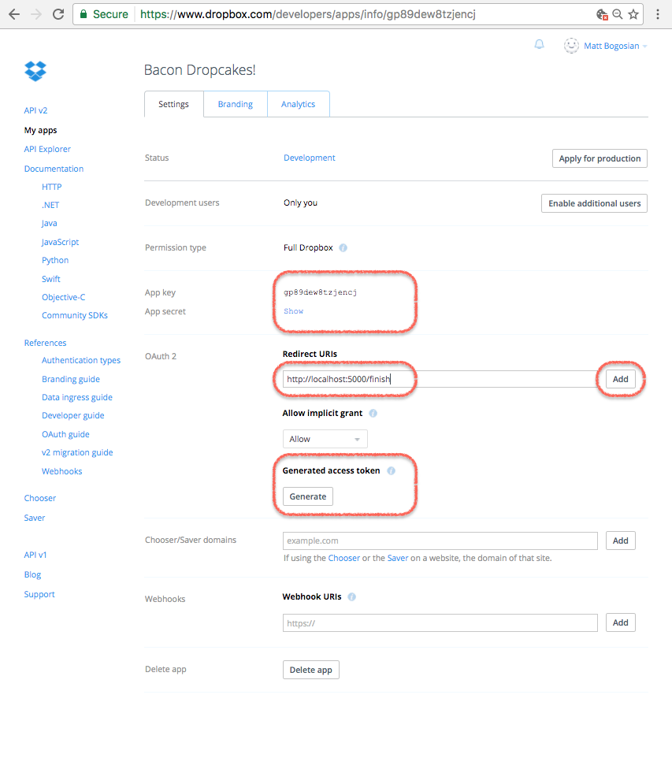
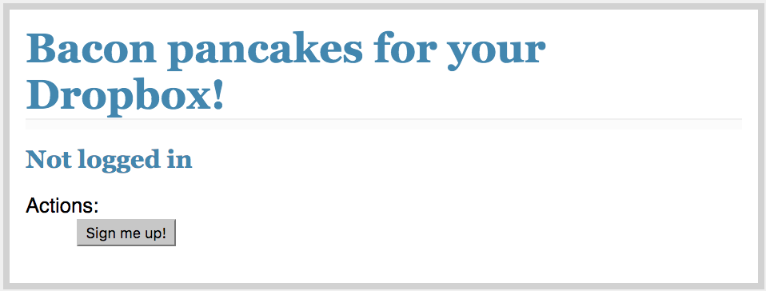
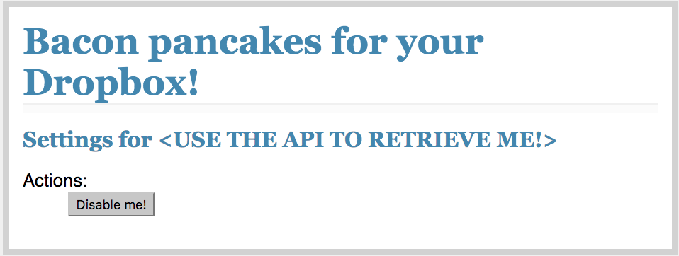

.. -*- encoding: utf-8; mode: rst -*-
    >>>>>>>>>>>>>>>>>>>>>>>>>>>>>>>>>>><<<<<<<<<<<<<<<<<<<<<<<<<<<<<<<<<<<
    >>>>>>>>>>>>>>>> IMPORTANT: READ THIS BEFORE EDITING! <<<<<<<<<<<<<<<<
    >>>>>>>>>>>>>>>>>>>>>>>>>>>>>>>>>>><<<<<<<<<<<<<<<<<<<<<<<<<<<<<<<<<<<
    Please keep each sentence on its own unwrapped line.
    It looks like crap in a text editor, but it has no effect on rendering, and it allows much more useful diffs.
    Thank you!

.. toctree::
    :maxdepth: 3
    :hidden:

Copyright |(c)| 2017 `Dropbox, Inc.`_

.. |(c)| unicode:: u+a9
.. _`Dropbox, Inc.`: https://www.dropbox.com/

Please see the accompanying :doc:`LICENSE <LICENSE>` and :doc:`CREDITS <CREDITS>` file(s) for rights and restrictions governing use of this software.
All rights not expressly waived or licensed are reserved.
If such a file did not accompany this software, then please contact the author before viewing or using this software in any capacity.

Tutorial
========

``dropbox-api-primer`` is a primer for version 2 of the `Dropbox API`_.

.. _`Dropbox API`: https://www.dropbox.com/developers/documentation/http/overview

License
-------

``dropbox-api-primer`` is licensed under the `MIT License <https://opensource.org/licenses/MIT>`_.
Source code is `available on GitHub <https://github.com/posita/dropbox-api-primer>`__.

Requirements
------------

A modern version of Python is required:

*   `cPython <https://www.python.org/>`_ (2.7 or 3.3+)

*   `PyPy <http://pypy.org/>`_ (Python 2.7 or 3.3+ compatible)

Python 2.6 will *not* work.

``dropbox-api-primer`` has the following dependencies (which will be installed automatically):

*   |dropbox|_
*   |flask|_
*   |future|_
*   |humanize|_

.. |dropbox| replace:: ``dropbox``
.. _`dropbox`: https://pypi.python.org/pypi/dropbox/
.. |flask| replace:: ``flask``
.. _`flask`: https://pypi.python.org/pypi/flask/
.. |future| replace:: ``future``
.. _`future`: https://pypi.python.org/pypi/future/
.. |humanize| replace:: ``humanize``
.. _`humanize`: https://pypi.python.org/pypi/humanize/

Create Your Dropbox Platform Application
----------------------------------------

Create a `Dropbox Platform application <https://www.dropbox.com/developers/apps/create>`_ (Dropbox account required):

    The Dropbox Platform app creation screen.

Once your app is created, you'll be shown its configuration screen.
Copy your app key (e.g., ``gp89dew8tzjencj``).
Click ``Show`` to display and copy your app secret (e.g., ``fs06ug2cpmy1863``).
Add ``http://localhost:5000/finish`` as an OAuth2 redirect URI.

    The Dropbox Platform app configuration screen.

Set Up Your Development Environment to Run Flask
------------------------------------------------

This project is meant to be cloned and then modified as necessary.
Development can be performed by creating a ``virtualenv`` and installing via ``pip``:

.. code-block:: sh

    $ git clone https://github.com/posita/dropbox-api-primer.git dropbox-api-primer
    ...
    $ cd dropbox-api-primer

Generate a secret key::

    $ python -c 'import os ; print("{!r}".format(os.urandom(24)))'
    'U\xb5\xf3\x9b07\xfe 3\xecJ\x86x\x81\xd1`g\xdb\x1cq\x00K\x96`'

Create a ``settings.cfg`` file in the repository directory:

.. code-block:: python

    # -*-mode: python; encoding: utf-8-*-
    SECRET_KEY = 'U\xb5\xf3\x9b07\xfe 3\xecJ\x86x\x81\xd1`g\xdb\x1cq\x00K\x96`'  # copied from above
    DBX_APP_KEY = 'gp89dew8tzjencj'  # copied from your app's settings page
    DBX_APP_SECRET = 'fs06ug2cpmy1863'  # copied from your app's settings page
    SITE_TITLE = 'Bacon pancakes for your Dropbox!'  # cosmetic - only used in local template rendering
    BASE_URL = 'http://localhost:5000/'

Set up the ``virtualenv``::

    $ source ./venvsetup.sh  # sets up virtualenv for development
    ...
    $ which python
    .../dropbox-api-primer/.venv/bin/python

Now you're ready to run your first Dropbox web application::

    $ export DBX_API_PRIMER_SETTINGS="${PWD}/settings.cfg"
    $ export FLASK_APP=dbx_api_primer/app.py
    $ export FLASK_DEBUG=true
    $ flask initdb
    initialized database
    $ flask run --without-threads
    * Serving Flask app "dbx_api_primer.app"
    * Forcing debug mode on
    * Running on http://127.0.0.1:5000/ (Press CTRL+C to quit)
    * Restarting with stat
    * Debugger is active!
    * Debugger pin code: ...

Test the Application
--------------------

You should be able to see something like the following when you browse to `localhost:5000`_:

.. _`localhost:5000`: http://localhost:5000/

    The app web page in its initial (disabled) state.

If you click on the ``Sign me up!`` button, you will be asked to approve the application on ``dropbox.com``.
Dropbox may require you to log in first.
Once approved, you will be forwarded back to the application, and should be able to see something like the following:

    The app web page in its enabled state.

You'll notice a problem, however.
The application does not display any user information.
Instead, it displays the string ``<USE THE API TO RETRIEVE ME!>``.

Use the API to Display the User's Information
---------------------------------------------

Find the following lines in the file ``dbx_api_primer/app.py``:

.. code-block:: python

    # ========================================================================
    @_APP.route('/finish')
    def route_finish():

        # ...

        # Brilliant! Now we can DO stuff!
        dbx_auth_token = auth_res.access_token
        dbx_acct_id = auth_res.account_id

        # TODO: Maybe now that we have an auth token, we can retrieve the
        # user's Dropbox account name and e-mail using the API?
        user_name = '<USE THE API TO RETRIEVE ME!>'
        user_email = None

        # ...

Take a look at the documentation for the |/2/users/get_current_account|_ endpoint and try to devise a way to use it to set the user's name and e-mail.

.. |/2/users/get_current_account| replace:: ``/2/users/get_current_account``
.. _`/2/users/get_current_account`: https://www.dropbox.com/developers/documentation/http/documentation#users-get_current_account

Here's one solution:

.. code-block:: python

    # ========================================================================
    @_APP.route('/finish')
    def route_finish():

        # ...

        # Brilliant! Now we can DO stuff!
        dbx_auth_token = auth_res.access_token
        dbx_acct_id = auth_res.account_id

        # Create the API proxy object
        dbx = dropbox.Dropbox(dbx_auth_token)

        try:
            # Retrieves the user information associated with the auth token
            user = dbx.users_get_current_account()
        except dropbox.exceptions.AuthError:
            _APP.logger.info('auth token (%s) no longer works', dbx_auth_token)

            return flask.redirect(flask.url_for('route_'))

        # Populate the user name from the Dropbox user object
        user_name = user.name.display_name

        # Populate the user e-mail from the Dropbox user object, but only if
        # the user's e-mail has been verified
        if user.email_verified:
            user_email = user.email
        else:
            user_email = None

        # ...

Flask should detect the change and restart automatically.
Navigate back to `localhost:5000`_ and click the ``Disable me!`` button.
Now click the ``Sign me up!`` button.
You should see your Dropbox user display name and e-mail address (if it's been verified).

Congratulations!
You've hacked in your first API call!

Use the API to Upload a File
----------------------------

Now let's do something more annoying---erm---*useful*.
Let's say that every time an authenticated user navigates to our application page, we want to make sure they have our super-compelling marketing materials waiting for them in their Dropbox.

Find the following lines in the file ``dbx_api_primer/app.py``:

.. code-block:: python

    # ========================================================================
    @_APP.route('/', methods=( 'GET', 'POST' ))
    def route_():

        # ...

        if flask.request.method == 'GET':
            # This displays the main page, which changes based on whether
            # the session contains a valid user ID
            template_vars = {
                'title': _APP.config['SITE_TITLE'],
            }

            if user_dbx_acct_entry is not None:
                user_name = user_dbx_acct_entry[bytes_to_native_str(b'user_name')]
                user_email = user_dbx_acct_entry[bytes_to_native_str(b'user_email')]
                template_vars['user_name'] = user_name

                if user_email is not None:
                    template_vars['user_email'] = user_email

                # TODO: Maybe we should do something fun here?

            return flask.render_template('settings.html', **template_vars)

        # ...

Devise some wicked compelling material that you can deliver in the form of a file.
Take a look at the documentation for the |/2/files/get_metadata|_ and |/2/files/upload|_ endpoints and make sure that your file is available in the user's Dropbox.

.. |/2/files/get_metadata| replace:: ``/2/files/get_metadata``
.. _`/2/files/get_metadata`: https://www.dropbox.com/developers/documentation/http/documentation#files-get_metadata
.. |/2/files/upload| replace:: ``/2/files/upload``
.. _`/2/files/upload`: https://www.dropbox.com/developers/documentation/http/documentation#files-upload

Here's one solution:

.. code-block:: python

    # ========================================================================
    @_APP.route('/', methods=( 'GET', 'POST' ))
    def route_():

        # ...

        if flask.request.method == 'GET':
            # This displays the main page, which changes based on whether
            # the session contains a valid user ID
            template_vars = {
                'title': _APP.config['SITE_TITLE'],
            }

            if user_dbx_acct_entry is not None:
                user_name = user_dbx_acct_entry[bytes_to_native_str(b'user_name')]
                user_email = user_dbx_acct_entry[bytes_to_native_str(b'user_email')]
                template_vars['user_name'] = user_name

                if user_email is not None:
                    template_vars['user_email'] = user_email

                # Make sure the user has our excellent and original and
                # not-at-all annoying content that is a little spammy, but
                # obviously not too spammy, and remind the user where
                # those materials can be found
                dbx_auth_token = user_dbx_acct_entry[bytes_to_native_str(b'dbx_auth_token')]
                dbx = dropbox.Dropbox(dbx_auth_token)
                # Dropbox's timestamps have a granularity of once second
                now_utc = datetime.datetime.utcnow().replace(microsecond=0)
                metadata = _put_link_file(dbx, now_utc)

                if metadata is not None:
                    created = now_utc == metadata.client_modified

                    if created:
                        message = "We've uploaded some great info to your Dropbox at <code>{}</code>!".format(metadata.path_display)
                    else:
                        humanized_time_diff = humanize.naturaltime(now_utc - metadata.client_modified)
                        message = "Don't forget to check out the great info we uploaded to your Dropbox at <code>{}</code> {}!".format(metadata.path_display, humanized_time_diff)

                    flask.flash(flask.Markup(message))

            return flask.render_template('settings.html', **template_vars)

    # ========================================================================
    def _put_link_file(dbx, client_modified):
        link_file_path = '/0000 - CLICK ME FOR BACON PANCAKES! - 0000.url'
        link_file_content = """
    [InternetShortcut]
    URL=https://youtu.be/TrcT7sseLZI
    """.lstrip().encode('utf-8')

        try:
            # Try to see if anything exists at our desired location
            metadata = dbx.files_get_metadata(link_file_path)
        except dropbox.exceptions.ApiError as exc:
            assert isinstance(exc.error, dropbox.files.GetMetadataError)

            if exc.error.is_path() \
                    and isinstance(exc.error.get_path(), dropbox.files.LookupError):
                try:
                    # The file doesn't exist, so try to upload it
                    metadata = dbx.files_upload(link_file_content, link_file_path, client_modified=client_modified)
                except dropbox.exceptions.ApiError as exc:
                    # Log, but ignore any errors. TODO: See if the error was
                    # a conflict, and then attempt to fetch the metadata one
                    # more time.
                    _APP.logger.info('failed writing file: %r', exc)
                    metadata = None
            else:
                _APP.logger.info('failed fetching metadata: %r', exc)
                metadata = None

        return metadata

Flask should detect the change and restart automatically.
Refresh `localhost:5000`_.
Note the differences and check your Dropbox account.
Try experimenting.
For example, try deleting the file and refreshing the page, or try clicking the various ``Disable me!`` or ``Sign me up!`` buttons in succession.
Try exploring the various `Dropbox API`_ endpoints and see what inspires you.
`The only limit is yourself. <http://www.zombo.com/>`_

Conclusion
----------

Congratulations!
You are now a certified expert social media marketer hacker prepared to deliver the latest compelling content to your ever-grateful and not-at-all resentful user base!
We look forward to seeing you as CEO of the next SaaS company with a name that sounds like a normal word, or maybe two normal words mashed together, but whose spelling is totally unintuitive because of edgy creativity, of course, and in no way because of any effort to enable more defensible trademark protections, obviously.
